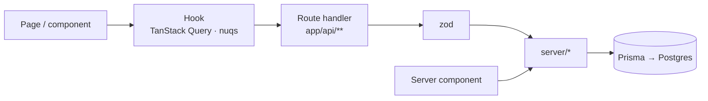

# CollegePick

Find the college that fits you, not just the one that ranks.

CollegePick is a college discovery tool: search and filter colleges, read fees, placements and
reviews on one page, compare up to three colleges side by side, and save what you shortlist.

- Live: _not deployed yet_
- Repo: https://github.com/krishna-2-005/collegepick

## Status

| Area | State |
|---|---|
| App scaffold and design system | Done |
| Database schema and seed | Done |
| Colleges, detail, reviews, compare, saved APIs | Done |
| Auth (email and password) | Done |
| Home, listing, detail, compare, saved pages | Done |
| Polish and accessibility pass | Done |
| Deploy (Vercel + Neon) | Ready, see [Deploy](#deploy) |

## Features

1. **College listing and search.** Search by name, city or course with a keyboard-friendly
   typeahead; filter by state, city, course, fee range, minimum rating, entrance exam and
   ownership; sort five ways; "Load 12 more" with cursor pagination. Every filter lives in the
   URL, so links are shareable and Back undoes a filter. On phones and tablets the filters
   move into a bottom drawer.
2. **College page.** Overview with key numbers, a courses table (duration, total and yearly
   fees, seats), placements (average, median, highest, placement rate, a chart, top
   recruiters), entrance-exam closing ranks, and reviews with a rating distribution. Signed-in
   users write a review in a dialog; it appears instantly and the rating updates.
3. **Compare colleges.** Pick two or three colleges from any card; a compare bar follows you
   around the site. `/compare?ids=a,b,c` shows them side by side with the best value in each
   row marked, plus a radar chart. Copy the link or save the comparison.
4. **Accounts and saved items.** Email and password sign-up and login, save colleges with the
   heart, save comparisons, and find both on `/saved`.
5. **Predictor (stretch).** `/predict`: pick an exam (JEE Main, JEE Advanced, NEET, CAT, GATE),
   enter your rank, optionally a state, and see colleges grouped as reach, good chance and safe
   from the 2025 closing ranks, with the gap to your rank on each row.

Screenshots at 375, 768 and 1280px go in [`docs/screenshots/`](docs/screenshots/)
(`pnpm screenshot`). Architecture notes are in [`docs/ARCHITECTURE.md`](docs/ARCHITECTURE.md)
and the walkthrough script in [`docs/LOOM_SCRIPT.md`](docs/LOOM_SCRIPT.md).

## Tech stack

Next.js 15 (App Router) · React 19 · TypeScript (strict) · Tailwind CSS v4 · PostgreSQL on Neon ·
Prisma · Auth.js · Zod · TanStack Query · zustand · nuqs · Recharts · lucide-react · sonner

## Run locally

Requires Node 20+, pnpm 10 and Docker (or any Postgres 16).

```bash
pnpm install
cp .env.example .env      # defaults point at the local Docker database
docker compose up -d      # Postgres 16 on localhost:5433
pnpm db:migrate           # apply migrations
pnpm db:seed              # 200 colleges, 40 reviewers, 1 demo account
pnpm dev                  # http://localhost:3000
```

Demo login: `demo@collegepick.dev` / `password123`. The component kit is at
[`/dev/ui`](http://localhost:3000/dev/ui).

| Script | What it does |
|---|---|
| `pnpm dev` | Start the dev server |
| `pnpm build` | Production build |
| `pnpm lint` | ESLint |
| `pnpm typecheck` | TypeScript, no emit |
| `pnpm db:migrate` / `db:deploy` | Create and apply migrations (dev) / apply only (prod) |
| `pnpm db:seed` | Wipe and reseed; same data every run |
| `pnpm db:studio` | Browse the database in Prisma Studio |
| `pnpm smoke` | API checks with curl (app must be running) |
| `pnpm a11y` | axe accessibility audit of every page (app must be running) |

**Images fail locally with "unable to verify the first certificate"?** Your network is
inspecting HTTPS with a certificate Node doesn't trust, so the image optimizer can't fetch
Unsplash. Set `NEXT_IMAGE_UNOPTIMIZED=1` in `.env` (local only) and rebuild; the browser then
loads images directly.
| `pnpm screenshot [/path ...]` | Full-page screenshots at 375, 768 and 1280px into `.screenshots/` (app must be running) |

## Design system

The interface is meant to feel like a clear decision tool: a calm surface, one bold accent, and
numbers doing the talking.

### Color tokens

Defined as CSS variables in `src/app/globals.css` and exposed to Tailwind as `bg-surface`,
`text-ink`, `border-line` and so on.

| Token | Value | Use |
|---|---|---|
| `--bg` | `#F7F8FA` | Page background |
| `--surface` | `#FFFFFF` | Cards, panels |
| `--ink` | `#14213D` | Primary text |
| `--ink-muted` | `#5B6478` | Secondary text |
| `--line` | `#E3E6EC` | Borders, dividers |
| `--accent` | `#1F5EFF` | Primary actions, links, active filters |
| `--accent-soft` | `#E8EEFF` | Selected chips, accent backgrounds |
| `--good` | `#12805C` | Best in row, high placement |
| `--warn` | `#B45309` | Fee warnings, low placement rate, destructive actions |
| `--gold` | `#C99A2E` | Rating stars only |

### Type

- Headings: Bricolage Grotesque 500/700. Body, UI and numbers: Inter 400/500/600.
- Scale: 12 / 14 / 16 / 18 / 22 / 28 / 36 / 52px. Body is 16px with 1.6 line height.
- Every number is set with tabular figures. Big numbers are always larger than their label.
- Sentence case everywhere; no all-caps labels.

### Shape and depth

- Radius: 6px for controls, 12px for cards, 20px for the hero panel and compare table.
- Depth comes from borders and the contrast between `--bg` and `--surface`. The one shadow is
  reserved for the sticky compare bar and dialogs.

### Motion

Only three things move in the whole app:

1. The compare bar slides up when the first college is added, and college avatars pop into it.
2. Filtered results cross-fade (150ms) when the list changes.
3. The save heart fills with a spring when tapped.

`prefers-reduced-motion` turns all three off.

## Architecture



Client components go through hooks and API routes; server components call the same
`server/*` functions directly. `server/*` is the only code that imports Prisma. Details,
rendering modes per route and the error model are in
[`docs/ARCHITECTURE.md`](docs/ARCHITECTURE.md).

```
src/
  app/          pages, route handlers (api/**), loading and error states
  components/   ui/ (design-system kit), college/, compare/, saved/, auth/, layout/
  hooks/        useColleges, useCollegeFilters, useSaved, useReviews, useSuggestions, …
  lib/          prisma, auth, api-response, api-client, validations/, format, cursor, rate-limit
  server/       colleges, reviews, saved, users (the only place Prisma is called)
  store/        compare selection (zustand)
  types/
prisma/         schema, migrations, seed
scripts/        smoke.sh, a11y.mjs, screenshot.mjs
```

## Data model


Seed data comes from `prisma/seed.ts`, built with a fixed faker seed: 200 fictional colleges in
15 states, 3–6 courses each, a placement record, exam cutoffs that follow the degrees offered,
and 3–8 reviews from 40 users. A hidden quality score per college drives rating, fees,
packages and cutoffs together, so the numbers stay believable relative to each other.

## API reference

Every response uses one envelope: `{ ok: true, data, meta? }` or
`{ ok: false, error: { code, message, details? } }`. Validation errors are 400 with zod
`details` (`[{ path, message }]`). Unexpected errors are logged and returned as a plain 500;
Prisma errors never reach the client.

| Method | Path | Notes |
|---|---|---|
| GET | `/api/colleges` | `q, state, city, course, exam, ownership, minFees, maxFees, minRating, sort, cursor, limit`. Arrays accept `a,b`, repeated keys or `key[]`. `limit` defaults to 12 and is clamped to 50. Returns `meta: { nextCursor, total }`. |
| GET | `/api/colleges/[slug]` | College with courses, placement, cutoffs, rating distribution and the latest 10 reviews. 404 for unknown slugs. |
| GET | `/api/colleges/[slug]/reviews` | Newest first, `cursor` + `limit` (1–20). Reviewer names are shown as "First L." `meta.viewerHasReviewed` when signed in. |
| POST | `/api/colleges/[slug]/reviews` | Auth. `{ rating 1–5, title, body }` → 201 with the new rating and count. 409 if you already reviewed it, 429 after 5 posts a minute. |
| GET | `/api/colleges/compare?ids=a,b,c` | 2–3 distinct slugs, returned in the order asked. 400 for 1, 4+, duplicates or malformed ids; 404 names any slug that doesn't exist. |
| GET · POST · DELETE | `/api/saved/colleges` | Auth. POST `{ collegeId }` is 201 new / 200 already saved. `DELETE ?collegeId=` is idempotent. |
| GET · POST · DELETE | `/api/saved/comparisons` | Auth. POST `{ slugs, name? }`; the same set in any order returns the existing one (200). `DELETE ?id=` only deletes your own (404 otherwise). |
| POST | `/api/auth/signup` | `{ name, email, password }` → 201 `{ id, name, email }`. 409 if the email exists (case-insensitive). Password 8–72 chars. The hash is never returned. |
| * | `/api/auth/*` | Auth.js: `csrf`, `callback/credentials`, `session`, `signout`. |
| GET | `/api/predict?exam&rank&state` | Colleges by band: reach (closing rank 0.8–1× yours), good (1–1.3×), safe (≥1.3×). Up to 18 per band, most competitive first, with full counts. |
| GET | `/api/filters` | States and cities with counts, degrees, exams, ownership, fee bounds. Static, revalidated hourly. |

`pnpm smoke` runs curl checks against a running app, covering happy paths and the error
cases (bad params, `minFees > maxFees`, malformed cursor, a full page walk with no gaps).

## Decisions

- **Own UI kit on native elements.** Dialog and Drawer use `<dialog>` with `showModal()` for focus
  trapping, Escape and an inert page without a library. The fee slider is two native range inputs,
  the star rating input is five native radios, and Select is a styled native `<select>`. Keyboard
  and screen reader behavior comes from the platform instead of custom code.
- **Tailwind defaults are removed.** The theme resets Tailwind's palette, shadows, radii and type
  scale, so an off-system class like `bg-gray-100` or `shadow-lg` produces no CSS. Only the tokens
  above exist.
- **Destructive actions use `--warn`.** The palette has no red; amber reads as "careful" and keeps
  the palette to the ten tokens.
- **No motion outside the three allowed animations.** Skeletons are static blocks (no pulse),
  loading buttons swap their label ("Saving college…") instead of showing a spinner, hover states
  change instantly, and sonner's toast transitions are turned off.
- **Toasts sit top-center with no shadow,** so they never cover the sticky compare bar and the
  single-shadow rule holds.
- **Tabular figures are set on `body`,** which guarantees every number lines up without relying
  on each component to remember it.
- **Hit targets:** small buttons and chips are 40px tall on mobile and 36px/32px from 768px up.
- **`noUncheckedIndexedAccess` is on** in addition to `strict`, so array and record lookups are
  typed as possibly undefined.
- **`/dev/ui` ships to production** with `noindex`. It documents the design system for reviewers
  and costs nothing at runtime.
- **Dependencies are added in the step that first uses them,** so each commit's `package.json`
  matches what the code actually imports.
- **Denormalized `rating`, `ratingCount`, `minFees`, `maxFees` on College.** The listing filters
  and sorts on these for every request; computing them with joins and aggregates over reviews
  and courses per row would make the hottest query the slowest one. They are written in the
  same transaction as the rows they summarise (reviews recompute rating and count), so they
  cannot drift. Fees are stored per year (`totalFees / durationYears`) because that is how
  students compare them.
- **Fictional colleges.** Names are built from rivers, ranges and Sanskrit words so the sample
  data never attaches invented fees or reviews to a real institution. `website` is left empty
  in the seed for the same reason; the "Visit website" button only renders when it is set.
- **Local Postgres in Docker for development, Neon in production.** Same Postgres 16 and same
  migrations; only `DATABASE_URL` changes. `DIRECT_URL` is separate because Neon's pooled
  connection can't run migrations.
- **Prisma 6, not 7.** Prisma 7 moves to required driver adapters and a new config file; 6 is
  the stable, well-documented line for this stack.
- **Keyset (cursor) pagination, not offset.** The cursor is an opaque base64 of the last row's
  sort value and id; the next page is `WHERE (sort, id) > cursor`. Offsets skip or repeat rows
  when a new review changes a rating between two "Load more" clicks, and they get slower the
  deeper you page. The trade-off is no "jump to page 7", which a "Load more" list doesn't need.
- **Fee filter means overlap.** `maxFees=200000` returns colleges with at least one programme at
  or under ₹2L a year, which matches how students read "under 2L".
- **Credentials auth with JWT sessions.** The brief asks for email and password, and JWT
  sessions keep auth stateless on serverless (no session table, no DB hit to read a session).
  The trade-off is that a session can't be revoked before it expires (30 days); a production
  version would add a token version on the user row. The config is split: `auth.config.ts` is
  dependency-free for middleware, `auth.ts` adds the Prisma/bcrypt provider.
- **Middleware only guards pages** (`/saved`, and bounces signed-in users away from
  `/login`). API routes check the session themselves with `requireUser()`, so a missing
  matcher can never expose data.
- **`?next=` is validated** (`safeNext`): only same-site relative paths are accepted, so
  `?next=//evil.com` or `?next=https://…` falls back to `/`.
- **Reviewer names are shortened** to "First L." in every API response.
- **Idempotent saves.** Saving twice returns 200 with the same result instead of an error, so a
  double tap or a retry after a flaky network never shows the user a failure. Status codes
  still tell the truth: 201 when something was created, 200 when it already existed.
- **Rate limiting returns 429**, the one status code beyond the plan's list, because "you
  already did this" (409) and "slow down" are different messages for the user.
- **Rendering per page.** Home is static and revalidated hourly. The listing renders its first
  page on the server for the exact URL, then the client takes over (the server result seeds the
  TanStack Query cache under the same canonical key, so there's no double fetch). College pages
  are ISR, cached on first visit and revalidated on demand when a review is posted.
- **No `loading.tsx` on college pages.** A streaming skeleton sends a 200 before the page can
  call `notFound()`, so unknown slugs would return 200. College pages are cached, so the
  skeleton would rarely show; a correct 404 matters more. The listing's skeleton lives in a
  `(list)` route group so it doesn't wrap the detail route.
- **Reviews publish optimistically.** The dialog closes and the review appears at the top at
  once; if the server rejects it (409, 429, network), the list rolls back and the dialog
  reopens with the draft and the reason.
- **Recharts is lazy-loaded** on the college page (~100 kB kept out of the first load) and chart
  animation is off, per the motion policy.
- **No gradient on the cover image.** The plan's layout puts the title below the image, so the
  image never needs a legibility gradient, and the design rules ban gradients.
- **`tailwind-merge` in `cn()`** so a `className` passed to a kit component reliably overrides
  its defaults (`h-11` then `h-13` resolves to `h-13`).
- **Compare state: URL on `/compare`, sessionStorage everywhere else.** The zustand store
  (persisted to sessionStorage, rehydrated after mount to avoid hydration mismatches) feeds the
  compare bar and the card toggles. On `/compare` the `ids` param is the source of truth and is
  mirrored back into the store, so a shared link becomes your selection, and opening `/compare`
  with no ids restores the tab's selection.
- **"Best" only when it means something.** A row marks a winner only if at least two colleges
  have a value and they differ. Fees and NIRF rank favour the lowest value; the rest favour
  the highest. The radar scores are relative to the colleges shown (cheapest fee = 100), which
  the chart says in its caption.
- **One validation message when there's one problem.** A 400 with a single zod issue uses that
  issue as the message ("Each college can only appear once in a comparison."), so the UI can
  show the API's words directly.
- **Strong shades for text on tints.** `--accent` on `--accent-soft` (and good/warn on their
  10% tints) measure just under 4.5:1, which axe flagged. Text on a tint uses a derived darker
  shade (`color-mix` of the token with `--ink`), so the palette stays the ten tokens.
- **Filter sidebar from 1024px, drawer below.** At 768px a 280px sidebar leaves ~165px cards
  whose fee ranges wrap, so tablets get the drawer too, and the grid stays at two columns
  until 1280px.
- **Animation code loads after first paint.** `LazyMotion` pulls framer-motion's features in
  asynchronously; every animation follows a user action, so nothing is lost.
- **Predictor bands are ratios of your rank**, not fixed gaps: 5,000 ranks is a lot at rank
  2,000 and nothing at rank 200,000. It was built before deploy (the plan puts it after)
  because deploy is waiting on hosting credentials.
- **Compare URLs use slugs** (`/compare?ids=kaveri-university-mysuru,…`) so shared links are
  readable; saved comparisons store college ids so they survive a slug change.
- **bcryptjs** instead of native `bcrypt`: same algorithm and hash format, no native build step
  on Vercel.

## Quality checks

| Check | Command | Result |
|---|---|---|
| API contract and edge cases | `pnpm smoke` | 117 checks passing |
| Accessibility (axe, WCAG 2.1 AA) | `pnpm a11y` | 0 violations on 14 pages at 375 and 1280px, logged in and out |
| Lighthouse, listing page, desktop | `lighthouse --preset=desktop` | Performance 98 |
| Lighthouse, listing page, mobile | `lighthouse` | Accessibility 98, Best practices 96, SEO 91, Performance 60–71 |
| Reduced motion | manual script | Compare bar and results fade render at rest immediately; no other CSS animation exists |

The mobile performance score was measured on a slow dev laptop (Lighthouse benchmark index
1067) under Lighthouse's 4× CPU throttle. Layout shift is 0; the cost is hydrating the
interactive listing (filters plus 12 cards with save/compare state). The fix is in
"What's next": render the first page of cards as server components.

## Edge cases

Each one is covered by `pnpm smoke` (117 checks) unless marked UI.

| Case | Behavior |
|---|---|
| Invalid query or body | 400 with zod `details: [{ path, message }]` |
| `minFees > maxFees` | 400, `details[0].path = "minFees"` |
| `limit` over 50 | Clamped to 50, not rejected |
| Malformed cursor | 400 "Start again from the first page" |
| Compare with 1, 4, duplicate or malformed ids | 400 with the specific reason |
| Compare with an unknown id | 404 naming the missing slug |
| Duplicate review | 409, one review per user per college (unique index) |
| Concurrent reviews on one college | Row lock in the transaction; rating always equals the true average |
| Review spam | 429 after 5 posts a minute per user (in-memory; Upstash for multi-instance) |
| Duplicate email (any case) | 409; emails are lowercased before insert |
| Save an already-saved college | 200, idempotent; unsave is idempotent too |
| Save the same comparison twice | Returns the existing one |
| Deleting someone else's comparison | 404, never reveals that it exists |
| Protected API without a session | 401 envelope |
| `/saved` without a session | 307 to `/login?next=%2Fsaved` |
| `?next=//evil.com` | Falls back to `/` |
| Unknown slug | 404 API, 404 page (UI) |
| Empty results | EmptyState with "Clear filters" (UI) |
| Typeahead stale responses | Aborted with AbortController (UI) |
| Compare selection on refresh | Persisted to sessionStorage (UI) |
| Prisma connections on serverless | Singleton client in `lib/prisma.ts` |

## Deploy

Vercel for the app, Neon for Postgres.

1. **Neon:** create a project. Copy the pooled connection string (host contains `-pooler`) and
   the direct one.
2. **Migrate and seed from your machine** against Neon:
   ```bash
   DATABASE_URL="<pooled>" DIRECT_URL="<direct>" pnpm db:deploy
   DATABASE_URL="<pooled>" DIRECT_URL="<direct>" pnpm db:seed
   ```
3. **Vercel:** import the GitHub repo (framework: Next.js, install: `pnpm install`). Add the
   environment variables for Production and Preview:
   `DATABASE_URL`, `DIRECT_URL`, `AUTH_SECRET` (`openssl rand -base64 32`),
   `NEXT_PUBLIC_APP_URL` (the Vercel URL). Do not set `NEXT_IMAGE_UNOPTIMIZED`.
4. Deploy. The build needs the database: the home page and `/api/filters` are pre-rendered.
5. Check it: `BASE_URL=https://<your-app>.vercel.app pnpm smoke` and `pnpm a11y`.

`postinstall` runs `prisma generate`, so Vercel's build has a client. Migrations are applied
explicitly (step 2), not during the build, so a failed deploy never half-migrates production.

## What's next

- **Server-render the first page of cards** on the listing so phones hydrate less (the main
  thing holding back mobile Lighthouse performance).
- **Revocable sessions:** a `tokenVersion` on the user, checked in the JWT callback.
- **Shared rate limiting** with Upstash Redis so the limit holds across serverless instances.
- **Search quality:** a `pg_trgm` index for typo-tolerant name search as the dataset grows.
- **Predictor accuracy:** closing ranks by category, quota and round, and several years of
  history, instead of one 2025 number per exam.
