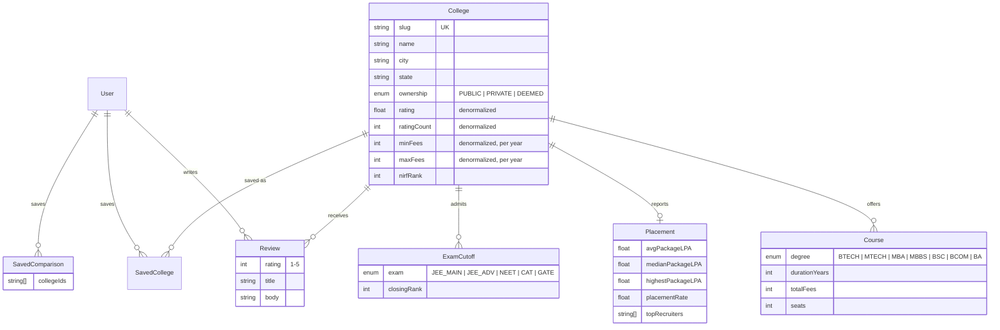

# CollegePick

Find the college that fits you, not just the one that ranks.

CollegePick is a college discovery tool: search and filter colleges, read fees, placements and
reviews on one page, compare up to three colleges side by side, and save what you shortlist.

- Live: _not deployed yet_
- Repo: https://github.com/krishna-2-005/collegepick

## Status

| Area | State |
|---|---|
| App scaffold and design system | Done |
| Database schema and seed | Done |
| Colleges, detail, reviews, compare, saved APIs | Planned |
| Auth (email and password) | Planned |
| Home, listing, detail, compare, saved pages | Planned |
| Deploy | Planned |

## Features

1. **College listing and search**: search by name, filter by state, city, course, fees, rating, exam and ownership, sort, load more.
2. **College detail**: overview, courses, placements and reviews.
3. **Compare colleges**: two or three colleges side by side, shareable link, save the comparison.
4. **Accounts and saved items**: sign up, log in, save colleges and comparisons.

## Tech stack

Next.js 15 (App Router) · React 19 · TypeScript (strict) · Tailwind CSS v4 · PostgreSQL on Neon ·
Prisma · Auth.js · Zod · TanStack Query · zustand · nuqs · Recharts · lucide-react · sonner

## Run locally

Requires Node 20+, pnpm 10 and Docker (or any Postgres 16).

```bash
pnpm install
cp .env.example .env      # defaults point at the local Docker database
docker compose up -d      # Postgres 16 on localhost:5433
pnpm db:migrate           # apply migrations
pnpm db:seed              # 200 colleges, 40 reviewers, 1 demo account
pnpm dev                  # http://localhost:3000
```

Demo login: `demo@collegepick.dev` / `password123`. The component kit is at
[`/dev/ui`](http://localhost:3000/dev/ui).

| Script | What it does |
|---|---|
| `pnpm dev` | Start the dev server |
| `pnpm build` | Production build |
| `pnpm lint` | ESLint |
| `pnpm typecheck` | TypeScript, no emit |
| `pnpm db:migrate` / `db:deploy` | Create and apply migrations (dev) / apply only (prod) |
| `pnpm db:seed` | Wipe and reseed; same data every run |
| `pnpm db:studio` | Browse the database in Prisma Studio |
| `pnpm screenshot [/path ...]` | Full-page screenshots at 375, 768 and 1280px into `.screenshots/` (app must be running) |

## Design system

The interface is meant to feel like a clear decision tool: a calm surface, one bold accent, and
numbers doing the talking.

### Color tokens

Defined as CSS variables in `src/app/globals.css` and exposed to Tailwind as `bg-surface`,
`text-ink`, `border-line` and so on.

| Token | Value | Use |
|---|---|---|
| `--bg` | `#F7F8FA` | Page background |
| `--surface` | `#FFFFFF` | Cards, panels |
| `--ink` | `#14213D` | Primary text |
| `--ink-muted` | `#5B6478` | Secondary text |
| `--line` | `#E3E6EC` | Borders, dividers |
| `--accent` | `#1F5EFF` | Primary actions, links, active filters |
| `--accent-soft` | `#E8EEFF` | Selected chips, accent backgrounds |
| `--good` | `#12805C` | Best in row, high placement |
| `--warn` | `#B45309` | Fee warnings, low placement rate, destructive actions |
| `--gold` | `#C99A2E` | Rating stars only |

### Type

- Headings: Bricolage Grotesque 500/700. Body, UI and numbers: Inter 400/500/600.
- Scale: 12 / 14 / 16 / 18 / 22 / 28 / 36 / 52px. Body is 16px with 1.6 line height.
- Every number is set with tabular figures. Big numbers are always larger than their label.
- Sentence case everywhere; no all-caps labels.

### Shape and depth

- Radius: 6px for controls, 12px for cards, 20px for the hero panel and compare table.
- Depth comes from borders and the contrast between `--bg` and `--surface`. The one shadow is
  reserved for the sticky compare bar and dialogs.

### Motion

Only three things move in the whole app:

1. The compare bar slides up when the first college is added, and college avatars pop into it.
2. Filtered results cross-fade (150ms) when the list changes.
3. The save heart fills with a spring when tapped.

`prefers-reduced-motion` turns all three off.

## Architecture

_Added with the API work: page → hook → route handler → zod → server → Prisma._

## Data model



Seed data is generated by `prisma/seed.ts` with a fixed faker seed: 200 fictional colleges in
15 states, 3–6 courses each, a placement record, exam cutoffs that follow the degrees offered,
and 3–8 reviews from 40 users. A hidden quality score per college drives rating, fees,
packages and cutoffs together, so the numbers stay believable relative to each other.

## API reference

Every response uses one envelope: `{ ok: true, data, meta? }` or
`{ ok: false, error: { code, message, details? } }`. Validation errors are 400 with zod
`details` (`[{ path, message }]`). Unexpected errors are logged and returned as a plain 500;
Prisma errors never reach the client.

| Method | Path | Notes |
|---|---|---|
| GET | `/api/colleges` | `q, state, city, course, exam, ownership, minFees, maxFees, minRating, sort, cursor, limit`. Arrays accept `a,b`, repeated keys or `key[]`. `limit` defaults to 12 and is clamped to 50. Returns `meta: { nextCursor, total }`. |
| GET | `/api/colleges/[slug]` | College with courses, placement, cutoffs, rating distribution and the latest 10 reviews. 404 for unknown slugs. |
| GET | `/api/colleges/[slug]/reviews` | Newest first, `cursor` + `limit` (1–20). Reviewer names are shown as "First L." |
| POST | `/api/auth/signup` | `{ name, email, password }` → 201 `{ id, name, email }`. 409 if the email exists (case-insensitive). Password 8–72 chars. The hash is never returned. |
| * | `/api/auth/*` | Auth.js: `csrf`, `callback/credentials`, `session`, `signout`. |
| GET | `/api/filters` | States and cities with counts, degrees, exams, ownership, fee bounds. Static, revalidated hourly. |

`pnpm smoke` runs curl checks against a running app, covering happy paths and the error
cases (bad params, `minFees > maxFees`, malformed cursor, a full page walk with no gaps).

## Decisions

- **Own UI kit on native elements.** Dialog and Drawer use `<dialog>` with `showModal()` for focus
  trapping, Escape and an inert page without a library. The fee slider is two native range inputs,
  the star rating input is five native radios, and Select is a styled native `<select>`. Keyboard
  and screen reader behavior comes from the platform instead of custom code.
- **Tailwind defaults are removed.** The theme resets Tailwind's palette, shadows, radii and type
  scale, so an off-system class like `bg-gray-100` or `shadow-lg` produces no CSS. Only the tokens
  above exist.
- **Destructive actions use `--warn`.** The palette has no red; amber reads as "careful" and keeps
  the palette to the ten tokens.
- **No motion outside the three allowed animations.** Skeletons are static blocks (no pulse),
  loading buttons swap their label ("Saving college…") instead of showing a spinner, hover states
  change instantly, and sonner's toast transitions are turned off.
- **Toasts sit top-center with no shadow,** so they never cover the sticky compare bar and the
  single-shadow rule holds.
- **Tabular figures are set on `body`,** which guarantees every number lines up without relying
  on each component to remember it.
- **Hit targets:** small buttons and chips are 40px tall on mobile and 36px/32px from 768px up.
- **`noUncheckedIndexedAccess` is on** in addition to `strict`, so array and record lookups are
  typed as possibly undefined.
- **`/dev/ui` ships to production** with `noindex`. It documents the design system for reviewers
  and costs nothing at runtime.
- **Dependencies are added in the step that first uses them,** so each commit's `package.json`
  matches what the code actually imports.
- **Denormalized `rating`, `ratingCount`, `minFees`, `maxFees` on College.** The listing filters
  and sorts on these for every request; computing them with joins and aggregates over reviews
  and courses per row would make the hottest query the slowest one. They are written in the
  same transaction as the rows they summarise (reviews recompute rating and count), so they
  cannot drift. Fees are stored per year (`totalFees / durationYears`) because that is how
  students compare them.
- **Fictional colleges.** Names are built from rivers, ranges and Sanskrit words so the sample
  data never attaches invented fees or reviews to a real institution. `website` is left empty
  in the seed for the same reason; the "Visit website" button only renders when it is set.
- **Local Postgres in Docker for development, Neon in production.** Same Postgres 16 and same
  migrations; only `DATABASE_URL` changes. `DIRECT_URL` is separate because Neon's pooled
  connection can't run migrations.
- **Prisma 6, not 7.** Prisma 7 moves to required driver adapters and a new config file; 6 is
  the stable, well-documented line for this stack.
- **Keyset (cursor) pagination, not offset.** The cursor is an opaque base64 of the last row's
  sort value and id; the next page is `WHERE (sort, id) > cursor`. Offsets skip or repeat rows
  when a new review changes a rating between two "Load more" clicks, and they get slower the
  deeper you page. The trade-off is no "jump to page 7", which a "Load more" list doesn't need.
- **Fee filter means overlap.** `maxFees=200000` returns colleges with at least one programme at
  or under ₹2L a year, which matches how students read "under 2L".
- **Credentials auth with JWT sessions.** The brief asks for email and password, and JWT
  sessions keep auth stateless on serverless (no session table, no DB hit to read a session).
  The trade-off is that a session can't be revoked before it expires (30 days); a production
  version would add a token version on the user row. The config is split: `auth.config.ts` is
  dependency-free for middleware, `auth.ts` adds the Prisma/bcrypt provider.
- **Middleware only guards pages** (`/saved`, and bounces signed-in users away from
  `/login`). API routes check the session themselves with `requireUser()`, so a missing
  matcher can never expose data.
- **`?next=` is validated** (`safeNext`): only same-site relative paths are accepted, so
  `?next=//evil.com` or `?next=https://…` falls back to `/`.
- **Reviewer names are shortened** to "First L." in every API response.
- **bcryptjs** instead of native `bcrypt`: same algorithm and hash format, no native build step
  on Vercel.

## Edge cases

_Documented as each API lands._

## What's next

_Filled in after deploy._
