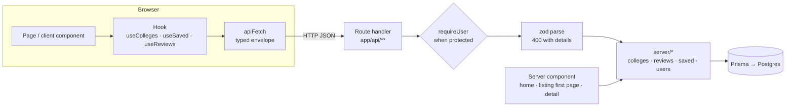

# Architecture

CollegePick is one Next.js 15 App Router app. Pages, API routes and the data layer live in the
same repo and deploy as one unit to Vercel; PostgreSQL runs on Neon.

## Request flow



Two ways in, one way to the database:

- **Client components** (filters, save, compare, reviews) call API routes through hooks. The
  hooks own caching, optimistic updates and rollback (TanStack Query).
- **Server components** (home, the first page of the listing, the college page) call the same
  `server/*` functions directly, skipping an HTTP hop to themselves. The listing seeds the
  client cache with that first page under the same canonical key, so there's no double fetch.

`server/*` is the only place Prisma is imported (enforced with `import "server-only"`). Route
handlers stay thin: auth check, zod, call `server/*`, return the envelope.

## Layers

| Layer | Path | Responsibility |
|---|---|---|
| Pages | `src/app/**/page.tsx` | Rendering mode, metadata, composition |
| Components | `src/components/{ui,college,compare,saved,auth,layout}` | UI; `ui/` is the design-system kit |
| Hooks | `src/hooks` | Client data (TanStack Query), URL state (nuqs), compare hydration |
| Store | `src/store/compare.ts` | Compare selection (zustand, sessionStorage) |
| Route handlers | `src/app/api/**/route.ts` | HTTP boundary: auth, validation, envelope |
| Validation | `src/lib/validations` | zod schemas shared by client forms and the API |
| Server | `src/server` | Queries, transactions, business rules |
| Infra | `src/lib/{prisma,auth,api-response,rate-limit,cursor}.ts` | Cross-cutting pieces |

## Error handling

Every route is wrapped in `route()`:

```ts
export const GET = route(async (request) => {
  const query = parseWith(collegeListQuerySchema, searchParamsToObject(request.nextUrl.searchParams));
  const { items, meta } = await listColleges(query);
  return ok(items, meta);
});
```

- `ApiError` (400/401/404/409/429) becomes `{ ok: false, error: { code, message, details? } }`.
- A zod failure becomes a 400; with one issue its message is the main message.
- Anything else is logged server-side and returned as a generic 500, so Prisma and stack
  details never reach the client.

On the client, `apiFetch` turns a failed envelope into an `ApiClientError` carrying the
server's message, which the UI shows as-is ("You've already reviewed this college…").

## Data model notes

- `College.rating`, `ratingCount`, `minFees`, `maxFees` are denormalized for the listing's
  filters and sorts. Reviews recompute rating and count inside the insert transaction, after a
  `SELECT … FOR UPDATE` on the college row, so concurrent reviews serialize.
- `Review @@unique([collegeId, userId])` enforces one review per user per college; the P2002
  error is mapped to a 409.
- `SavedCollege` has a composite primary key, which makes saving idempotent.
- `SavedComparison.collegeIds` stores ids (stable) while compare URLs use slugs (readable).

## Pagination

Keyset, not offset. The cursor is an opaque base64 of `{ v: sortValue, id }` for the last row;
the next page is rows strictly after `(v, id)` in the current sort order. Each sort has an
explicit tiebreak on `id`, so the order is total and pages never overlap or skip, even while
reviews change ratings. `pnpm smoke` walks all 200 rows in every sort to prove it.

## Rendering

| Route | Mode | Why |
|---|---|---|
| `/` | Static, revalidated hourly and on review | Same for everyone |
| `/colleges` | Dynamic (first page on the server) | Depends on the URL's filters |
| `/colleges/[slug]` | ISR on first visit, revalidated on review | Cacheable, correct 404 status |
| `/compare` | Dynamic | Shared links render with data for previews |
| `/saved` | Dynamic, protected | Per user |
| `/api/filters` | Static, revalidated hourly | Changes only with new colleges |

## Auth

Auth.js v5, credentials provider, JWT sessions. `auth.config.ts` holds the dependency-free part
for middleware; `auth.ts` adds the Prisma/bcrypt provider. Middleware protects `/saved` and
bounces signed-in users away from `/login` and `/signup`; API routes check the session
themselves with `requireUser()`. `?next=` is validated to a same-site relative path.
